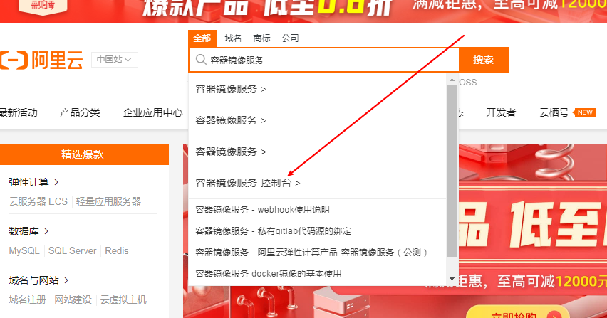
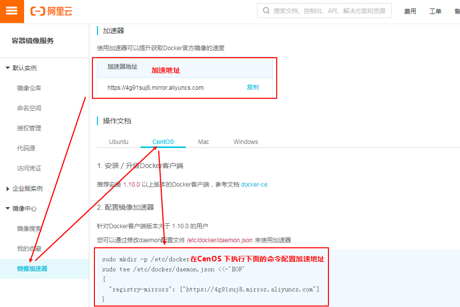

# CentOs安装Docker
## 1. 检查内核版本，必须是3.10及以上
```shell
uname -r
```
## 2. yum 包更新到最新
```shell
yum update
```
## 3. 卸载旧版（如果你已经安装过docker）
```shell
yum remove docker  docker-common docker-selinux docker-engine
```
## 4. 安装需要的软件包， yum-util 提供yum-config-manager功能，另外两个是devicemapper驱动依赖的
```shell
yum install -y yum-utils device-mapper-persistent-data lvm2
```
## 5. 设置yum源
```shell
yum-config-manager --add-repo https://download.docker.com/linux/centos/docker-ce.repo
```
## 6. 安装docker，出现输入的界面都按 y
```shell
yum install -y docker-ce
```
## 7. 查看docker版本，验证是否验证成功
```shell
docker -v
```
## 8. 设置开机自动启动docker
```shell
systemctl enable docker
```
## 9. 配置镜像加速器
进入阿里云：https://account.aliyun.com 登录账号，搜索：

获取加速地址并配置

1. 在etc里面创建docker文件夹
2. 创建daemon.json文件，写入自己的加速地址
3. 守护进程重新加载
4. 重新启动docker
替换自己的加速地址复制执行即可
```base
sudo mkdir -p /etc/docker
sudo tee /etc/docker/daemon.json <<-'EOF'
{
  "registry-mirrors": ["https://uomb8t0n.mirror.aliyuncs.com"]
}
EOF
sudo systemctl daemon-reload
sudo systemctl restart docker
```
