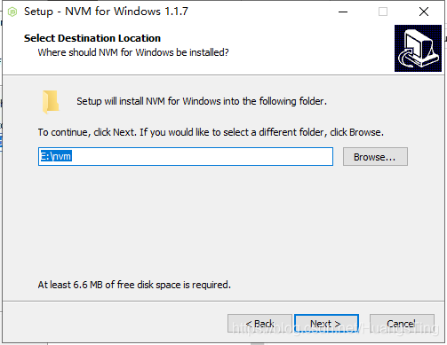

# nvm安装教程
## 1. 下载nvm
nvm下载地址：https://github.com/coreybutler/nvm-windows/releases

选择nvm安装路径，注意路径不要有空格和中文。

选择nodejs的安装路径。

安装完成后在终端输入nvm version，能查到版本号说明安装成功了。

## 2. nvm常用命令

```cmd
nvm list                # 查看已安装的node版本
nvm version             # 查看nvm版本
nvm list available      # 查看可安装的node版本
nvm install <version>   # 安装指定版本的node
nvm use <version>       # 使用指定版本的node
nvm uninstall <version> # 卸载指定版本的node
nvm on                  # 开启nvm
nvm off                 # 关闭nvm
```

## 3. 下载node

```cmd
# 查看可安装的node版本
nvm list available
# 安装指定版本的node
nvm install 20.12.2
```

```cmd
# 查看已安装的node版本
nvm list
# 使用指定版本的node
nvm use 20.12.2
```
## 4. 配置node环境

### 4.1 配置node全局模块路径
在nodejs文件夹中创建node_cache和node_global文件夹

修改缓存路径
```cmd
npm config set prefix "D:\nodejs\node_global"
npm config set cache "D:\nodejs\node_cache" 
```
### 4.2 设置npm镜像
```cmd
## 国内镜像
npm config set registry https://registry.npmmirror.com/
## 官方镜像
npm config set registry https://registry.npmjs.org/
```
### 4.3 npm代理
```cmd
npm config set proxy http://server:port
npm config set https-proxy http://server:port
```
### 4.4 统一配置文件
路径：C:\Users\用户名，文件名：.npmrc
```text
prefix=D:\nodejs\node_global
cache=D:\nodejs\node_cache
registry=https://registry.npmmirror.com/
proxy=socks5://127.0.0.1:1080
https-proxy=socks5://127.0.0.1:1080
```
## 5. node环境变量


用户变量添加node_global路径：D:\nodejs\node_global
